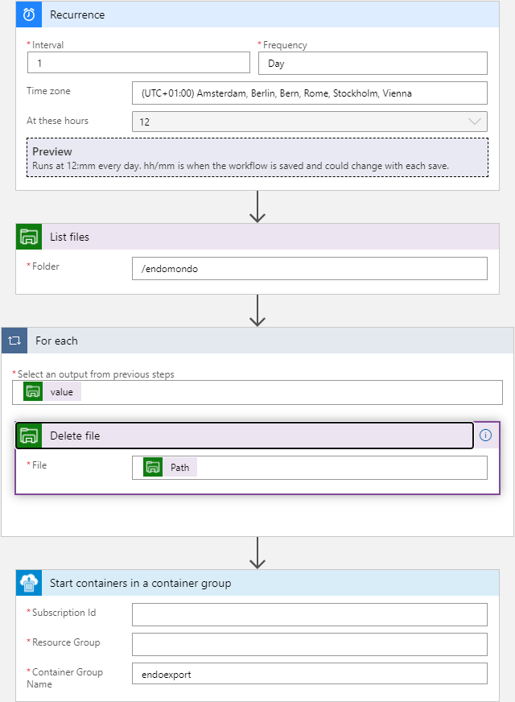

# Azure Container instances

One of the easiest ways to run this container is on Azure; especially if you have a playground subscription :-)

1) Create a storage account and a fileshare in that account. 
    - Make sure you note the name of the stroage account and the fileshare
    - Get the access key of the storage account

2) Create an Azure container instance using Cloud Shell (with bash) in the Azure portal. If you're using a Powershell editor make sure you replace \ with the uptick"character (\`) in the code below. NB: the container won't have a public or private network connection. Check for erors in the container group's logs.

```bash
az container create \
    --location <preferred Azure Region> \
    --resource-group <ResourceGroup name> \
    --name endoexport \
    --image sjambor/endoexport \
    --environment-variables ENDO_USER="endouser@yourprovider.com" \
    --secure-environment-variables ENDO_PASS="supersecretpassword" \
    --restart-policy Never \
    --azure-file-volume-account-name <storage account name> \
    --azure-file-volume-account-key <storage account key> \
    --azure-file-volume-share-name <file share name> \
    --azure-file-volume-mount-path /root/endoexport/gpx
```

3) I use a Logic App to clean out the download folder once a day and fill it again with everything from Endomondo. Obviously you'll want to stop this app before UA pulls the plug on Endomondo....  My Logic app looks like this:

